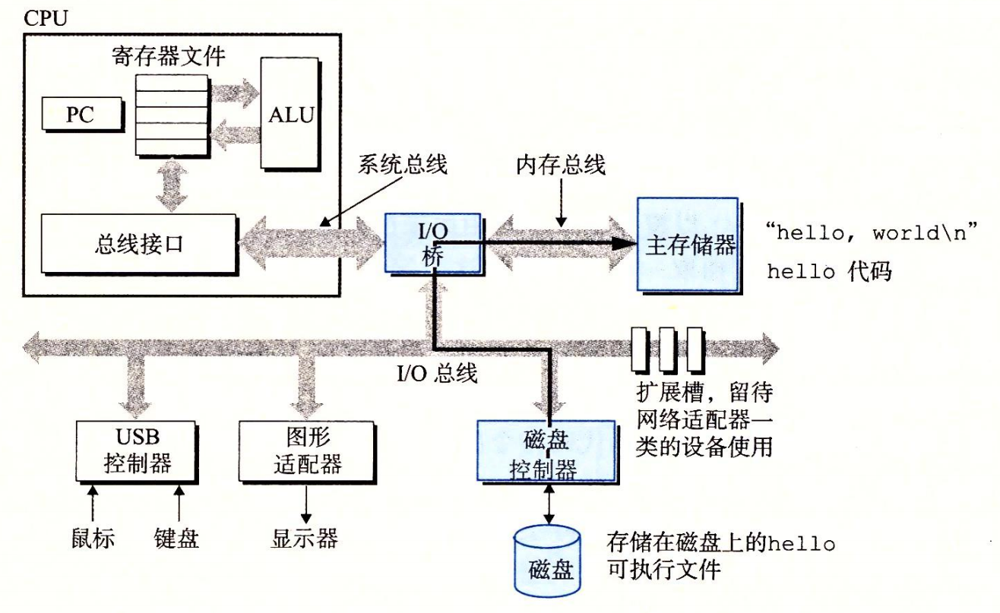

#### 1、HelloWorld

```c
#include <stdio.h>
int main()
{
	printf("hello world\n");
	return 0;	
}
```

1. 源程序hello.c，由0、1组成的位序列，8位（bit）=1字节（byte）。每个字节表示程序中的文本字符（ASCII标准）
2. 文本文件：只由ASCII字符构成的文件
3. 不同的上下文中，同样的字节序列表示的含义不同

#### 2、翻译

可执行目标文件：将源文件中的每条语句，转换为低级的**机器语言指令**，按照**可执行目标程序的格式**打包，以**二进制形式存储**起来

gcc -o hello hello.c


1. 预处理阶段：预处理器（cpp）根据以字符#开头的命令，修改原始的c程序，输出hello.i

2. 编译阶段：汇编器（ccl）将文本文件hello.i翻译为汇编代码的文本文件hello.s

   ```
   main:
   	subq	$8,	%rsp
   	movl 	$.LCO, %edi
   	call 	puts
   	movl	$0, %eax
   	addq	$8, %rsp
   	ret
   
   //不同的语言，不同的编译器，同样功能的代码，最终都会输出同样的汇编语言
   ```

3. 汇编阶段：汇编器（as）将hello.s，翻译成机器语言指令，打包成可重定位目标程序hello.o（二进制文件）

4. 链接阶段：链接器（ld）将其他的.o程序以某种方式合并为hello可执行文件

#### 3、Shell

shell是一个命令行解释器，输出一个提示符，等待命令，如果第一个单词不是内置的shell命令，那么shell会认为是一个可执行的文件名，将加载并运行这个文件

```
sh-3.2$ ./hello
hello world
sh-3.2$ 
```

#### 4、系统的硬件组成


1. 总线：携带定长的字节（byte = 8位bit）块，也就是字（word）在设备间传递信息，大多数字长32位或者64位

2. IO设备：键盘鼠标，显示器，和磁盘（用于长期存储数据和程序），键盘鼠标和磁盘通过控制器与IO总线相连，而显示器通过适配器与IO总线相连。**控制器和适配器的功能都是在IO总线和IO设备之间传递信息**

3. 主存：临时存储设备，用来存放程序和程序处理的数据。物理上是一组**动态随机存取存储器（DRAM）**芯片组成，逻辑上是线性的字节数组，每个字节都有其唯一的地址（数组索引），这些地址从0开始。每条机器指令都是由不同数量的字节组成

4. 处理器（CPU）：解释或者执行主存中的指令。核心为大小为一个字（word，32位或64位）的**程序计数器**（pc），指向主存中某条机器语言指令（即含有该条指令的地址）

   **指令执行**：处理器从PC指向的内存处读取指令，解释指令中的位，执行该指令的简单操作，然后更新PC，使其指向下一条指令（这条指令的位置并不一定与刚刚执行的指令位置相邻）

   **围绕主存，寄存器文件和算术/逻辑单元（ALU）进行**。寄存器文件（register file）：由一些单个字长的寄存器组成，每个寄存器有自己的名字。ALU：计算新的数据和地址值

   **加载**：从主存复制一个字节或一个字到寄存器，覆盖原来的内容

   **存储**：从寄存器复制一个字节或者一个字到主存的某个位置，以覆盖这个位置上原来的内容

   **操作**：把两个寄存器中的内容复制到ALU，ALU对这两个字做算术运算，并将结果存放到一个寄存器中

   **跳转**：从指令本身抽取一个字，将这个字复制到PC中，以覆盖原来PC中的值

#### 5、运行hello

1. shell程序收到指令./hello，将字符读入寄存器，再放入主存中

   

2. 回车，shell程序执行一系列指令加载可执行的hello文件，将代码和数组从磁盘复制到主存，（DMA可以不通过处理器直接到达主存）

   

3. 执行main中的机器指令，将字符hello world\n复制到寄存器文件，再从寄存器文件中复制到显示设备

   

#### 6、高速缓存

存放处理器近期可能会需要的信息（静态随机访问存储器L1，L2）

1. **L1高速缓存**：位于处理器芯片上，容量可达数w字节，速度几乎和寄存器文件一样
2. **L2高速缓存**：通过特殊总线连接到处理器，容量数十万到数百万字节，访问速度是L1的5倍，但仍然比主存快5-10倍
3. **L3高速缓存**：

#### 7、进程

文件是对IO设备的抽象表示，虚拟内存是对主存和磁盘IO设备的抽象表示，进程是对处理器、主存和IO设备的抽象表示。

**进程是操作系统对一个正在运行的程序的抽象**

**上下文切换：**操作系统保持跟踪进程运行所需的所有状态信息**即上下文**（PC和寄存器文件的当前值，主存的内容）。操作系统将控制权从当前进程转移到另一进程时，就会进行上下文切换（保存当前进程的上下文，恢复新进程的上下文）


操作系统**内核（kernel）**管理从一个进程切换到另一个进程。内核是操作系统代码常驻主存的部分。应用程序需要操作系统某些操作时，通过**系统调用**指令，将控制权传递给内核，内核执行被请求的操作，然后返回。

内核不是一个独立的进程，是系统管理全部进程所用代码和数据结构的集合。

#### 8、线程

一个进程可以有多个线程的执行单元组成，运行在进程的上下文中，共享同样的代码和数据

#### 9、虚拟内存

为每个进程提供假象，独占主存。每个进程看到的内存都是一致的，成为**虚拟地址空间**


1. 程序代码和数据：对所有进程来说，代码都是从同一固定地址开始
2. 堆：动态扩展和收缩，malloc和free
3. 共享库：标准库代码和数据
4. 栈：用来函数调用，动态扩展和收缩
5. 内存虚拟地址：内核使用

#### 10、文件

文件就是字节序列。

#### ASICC码表

- 控制字符


- 可显示字符

