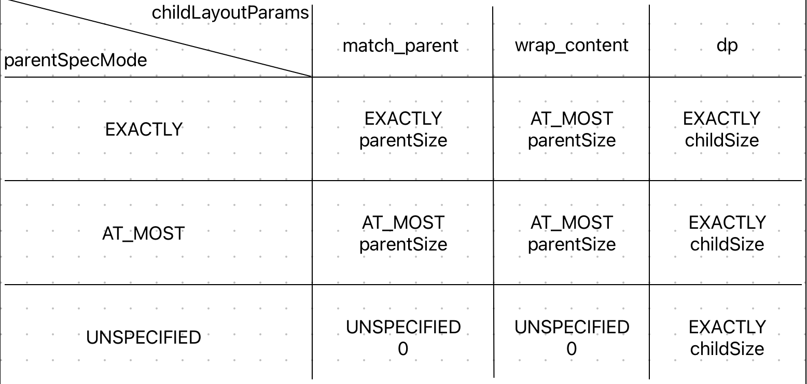

#### 父View确定子View的MeasureSpec

##### getRootMeasureSpec@ViewRootImpl

ViewRootImpl测量子View（一般是DecorView）时确定MeasureSpec的算法

```java
----> getRootMeasureSpec@ViewRootImpl:

//windowSize == 窗口提供的大小
//measurement == DecorView想要的大小
private static int getRootMeasureSpec(int windowSize, int measurement, int privateFlags) {
    int measureSpec;
  	//设置了PRIVATE_FLAG_LAYOUT_SIZE_EXTENDED_BY_CUTOUT，MATCH_PARENT
  	//没有设置，measurement
    final int rootDimension = (privateFlags & PRIVATE_FLAG_LAYOUT_SIZE_EXTENDED_BY_CUTOUT) != 0
            ? MATCH_PARENT : measurement;
    switch (rootDimension) {
        case ViewGroup.LayoutParams.MATCH_PARENT:
            //想要占满窗口（EXACTLY + windowSize）
            measureSpec = MeasureSpec.makeMeasureSpec(windowSize, MeasureSpec.EXACTLY);
            break;
        case ViewGroup.LayoutParams.WRAP_CONTENT:
            //根据自己内容确定（AT_MOST + windowSize）
            measureSpec = MeasureSpec.makeMeasureSpec(windowSize, MeasureSpec.AT_MOST);
            break;
        default:
            //自己要固定大小（EXACTLY + rootDimension）
            measureSpec = MeasureSpec.makeMeasureSpec(rootDimension, MeasureSpec.EXACTLY);
            break;
    }
    return measureSpec;
}
```

##### getChildMeasureSpec@ViewGroup

ViewGroup自带的确定子View的MeasureSpec尺寸的算法

```java
----> getChildMeasureSpec@ViewGroup:

//spec == parent的MeasureSpec（parent的parent对他的尺寸要求）
//padding == parent两边的padding
//childDimension == 子view的LayoutParent中自己想要的尺寸
public static int getChildMeasureSpec(int spec, int padding, int childDimension) {
  	//获取父View的MeasureSpec中的模式和大小
    int specMode = MeasureSpec.getMode(spec);
    int specSize = MeasureSpec.getSize(spec);
		
  	//实际上parent可以使用的size
    int size = Math.max(0, specSize - padding);

    int resultSize = 0;
    int resultMode = 0;

    switch (specMode) {
    //父View的大小确定，确切值specSize 
    case MeasureSpec.EXACTLY:
        if (childDimension >= 0) {
          	//子view想要个确切值（EXACTLY + childDimension）
            resultSize = childDimension;
            resultMode = MeasureSpec.EXACTLY;
        } else if (childDimension == LayoutParams.MATCH_PARENT) {
            //子view想占满父view（EXACTLY + size）
            resultSize = size;
            resultMode = MeasureSpec.EXACTLY;
        } else if (childDimension == LayoutParams.WRAP_CONTENT) {
            //子view根据内容确定大小（不确定大小） - （AT_MOST + size）
            resultSize = size;
            resultMode = MeasureSpec.AT_MOST;
        }
        break;

    //父view的大小不确定，有个参考的最大值specSize
    case MeasureSpec.AT_MOST:
        if (childDimension >= 0) {
            //子view想要个确切值（EXACTLY + childDimension）
            resultSize = childDimension;
            resultMode = MeasureSpec.EXACTLY;
        } else if (childDimension == LayoutParams.MATCH_PARENT) {
            //子view想占满父view（AT_MOST + size）
            resultSize = size;
            resultMode = MeasureSpec.AT_MOST;
        } else if (childDimension == LayoutParams.WRAP_CONTENT) {
            //子view根据内容确定大小（不确定大小） - （AT_MOST + size）
            resultSize = size;
            resultMode = MeasureSpec.AT_MOST;
        }
        break;

    //父view大小随意
    case MeasureSpec.UNSPECIFIED:
        if (childDimension >= 0) {
            //子view想要个确切值（EXACTLY + childDimension）
            resultSize = childDimension;
            resultMode = MeasureSpec.EXACTLY;
        } else if (childDimension == LayoutParams.MATCH_PARENT) {
            //子view想占满父view
          	//sUseZeroUnspecifiedMeasureSpec：UNSPECIFIED时size为0？？？
          	//（UNSPECIFIED + 0/size）
            resultSize = View.sUseZeroUnspecifiedMeasureSpec ? 0 : size;
            resultMode = MeasureSpec.UNSPECIFIED;
        } else if (childDimension == LayoutParams.WRAP_CONTENT) {
            //子view根据内容确定大小（不确定大小）
          	//sUseZeroUnspecifiedMeasureSpec：UNSPECIFIED时size为0？？？
          	//（UNSPECIFIED + 0/size）
            resultSize = View.sUseZeroUnspecifiedMeasureSpec ? 0 : size;
            resultMode = MeasureSpec.UNSPECIFIED;
        }
        break;
    }
  	//mode + size = 组成MeasureSpec
    return MeasureSpec.makeMeasureSpec(resultSize, resultMode);
}
```



#### View根据MeasureSpec确定自己的尺寸

##### getDefaultSize@View

```java
----> getDefaultSize@View:

//size：子View默认尺寸
//measureSpec：parent要求
public static int getDefaultSize(int size, int measureSpec) {
    int result = size;
    int specMode = MeasureSpec.getMode(measureSpec);
    int specSize = MeasureSpec.getSize(measureSpec);

    switch (specMode) {
    case MeasureSpec.UNSPECIFIED:
        result = size;
        break;
    //AT_MOST和EXACTLY都是parent给的尺寸
    case MeasureSpec.AT_MOST:
    case MeasureSpec.EXACTLY:
        result = specSize;
        break;
    }
    return result;
}
```

##### resolveSizeAndState@View

```java
----> resolveSizeAndState@View:

//size：自己想要的尺寸
//measureSpec：parent的要求
public static int resolveSizeAndState(int size, int measureSpec, int childMeasuredState) {
    final int specMode = MeasureSpec.getMode(measureSpec);
    final int specSize = MeasureSpec.getSize(measureSpec);
    final int result;
    switch (specMode) {
        //给你个最大尺寸specSize
        case MeasureSpec.AT_MOST:
        		//parent能给的最大尺寸少于我想要的尺寸
        		//result = specSize，且添加MEASURED_STATE_TOO_SMALL标记（你给的太少了）
        		//否则 result = size
            if (specSize < size) {
                result = specSize | MEASURED_STATE_TOO_SMALL;
            } else {
                result = size;
            }
            break;
        //就要你用我的具体尺寸
        case MeasureSpec.EXACTLY:
        		//result = parent给的尺寸
            result = specSize;
            break;
        case MeasureSpec.UNSPECIFIED:
        default:
            result = size;
    }
    return result | (childMeasuredState & MEASURED_STATE_MASK);
}
```

