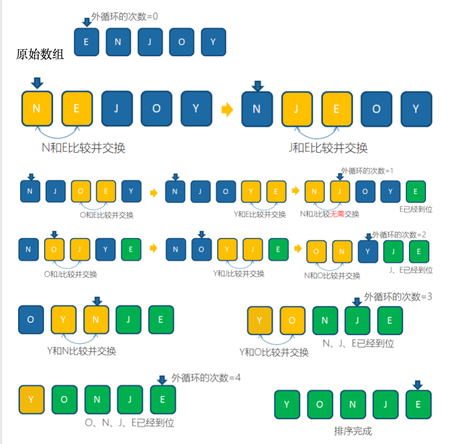
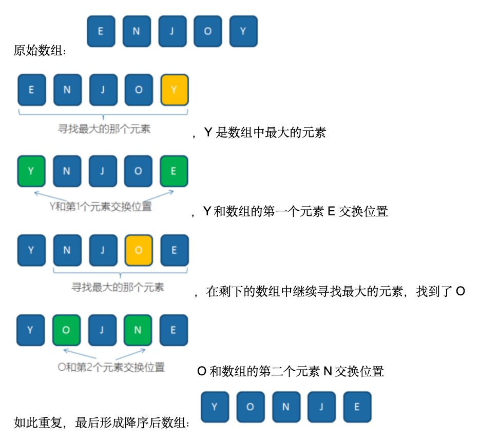

#### 冒泡排序

> 从头开始比较相邻的两个，如果前面大，交换顺序，一轮下来，数组中最大的数就会被交换到末尾
>
> 从剩下的数中，再次进行一轮比价交换，最大的数就会交换到末尾
>
> 比较n轮，数组就从小到大排列了

​	

```java
public static int[] sort(int[] nums){
    if (nums.length <= 1) return nums;
  	//排序次数
    for (int i = 0; i < nums.length; i++) {
      	//比较次数nums.length - 1 - i，每次排序完成都会减少一次比较
        for (int j = 0; j < nums.length - 1 - i; j++) {
            if (nums[j] > nums[j + 1]) {
                int temp = nums[j];
                nums[j] = nums[j + 1];
                nums[j + 1] = temp;
            }
        }
    }
    return nums;
}
```

#### 选择排序

> 循环选择出最小/最大的值，与指定的下标交换数据，n轮循环后就完成排序

​	

```java
public static int[] sort(int[] array){
    for (int i = 0; i < array.length; i++) {
        int index = i;
        for (int j = i; j < array.length; j++) {
            if (array[index] > array[j]){
                index = j;
            }
        }
        int temp = array[index];
        array[index] = array[i];
        array[i] = temp;
    }
    return array;
}
```

#### 插入排序

> 从未排序的数据中取出数据，依次与已排序的数据进行比较，找到合适的位置
