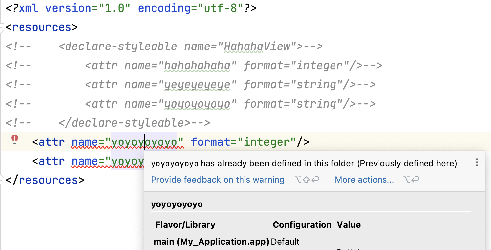

#### 1、基本用法

- 在res/values/attrs.xml文件中申明属性

  ```xml
  <?xml version="1.0" encoding="utf-8"?>
  <resources>
      <attr name="hahahaha" format="integer"/>
  </resources>
  ```

- 自定义View，并在xml中使用定义的属性

  ```xml
  <com.example.xiao.myapplication.HahahaView
      android:layout_width="wrap_content"
      android:layout_height="wrap_content"
      app:layout_constraintBottom_toBottomOf="parent"
      app:layout_constraintEnd_toEndOf="parent"
      app:layout_constraintStart_toStartOf="parent"
      app:layout_constraintTop_toTopOf="parent"
      app:hahahaha="12"/>
  ```

- 在HahahaView中获取属性值

  ```kotlin
  init {
      val typedArray = context.obtainStyledAttributes(
          attrs,
          intArrayOf(R.attr.hahahaha)
      )
      val int = typedArray.getInt(0, -1)
      Log.e("HahahaView", int.toString())
      typedArray.recycle()
  }
  
  打印结果
  16:58:08.269 16543-16543 HahahaView               E  12
  
  成功，yeah，正确获取到属性值
  ```

#### 2、问题

- **多个属性怎么办呢？**

  > 如果多个属性，可以定义在<declare-styleable>标签下，方便使用

  ```xml
  <declare-styleable name="HahahaView">
    <attr name="hahahahaha" format="integer"/>
    <attr name="yeyeyeyeye" format="string"/>
    <attr name="yoyoyoyoyo" format="string"/>
  </declare-styleable>
  ```

  > 使用和获取到定义的值

  ```kotlin
  <com.example.xiao.myapplication.HahahaView
      android:layout_width="wrap_content"
      android:layout_height="wrap_content"
      app:layout_constraintBottom_toBottomOf="parent"
      app:layout_constraintEnd_toEndOf="parent"
      app:layout_constraintStart_toStartOf="parent"
      app:layout_constraintTop_toTopOf="parent"
      app:hahahahaha="12"
      app:yeyeyeyeye="ye"
      app:yoyoyoyoyo="yo" />
  
  val typedArray = context.obtainStyledAttributes(attrs,R.styleable.HahahaView)
  val int = typedArray.getInt(R.styleable.HahahaView_hahahahaha, -1)
  Log.e("HahahaView", int.toString())
  val string1 = typedArray.getString(R.styleable.HahahaView_yeyeyeyeye)?: ""
  Log.e("HahahaView", string1)
  val string2 = typedArray.getString(R.styleable.HahahaView_yoyoyoyoyo)?: ""
  Log.e("HahahaView", string2)
  typedArray.recycle()
  
  17:26:36.211 16914-16914 HahahaView               E  12
  17:26:36.211 16914-16914 HahahaView               E  ye
  17:26:36.211 16914-16914 HahahaView               E  yo
  ```

- **获取自己想要的属性**

  > 系统在解析布局xml是，会讲View的属性统一保存在AttributeSet中，可以重View的attrs字段中获取到所有的属性

  ```kotlin
  init {
      for (i in 0 until attrs.attributeCount) {
          Log.e("HahahaView", "attributeName = ${attrs.getAttributeName(i)}, " +
                  "attributeValue = ${attrs.getAttributeValue(i)}")
      }
  }
  
  E  attributeName = layout_width, attributeValue = -2
  E  attributeName = layout_height, attributeValue = -2
  E  attributeName = hahahahaha, attributeValue = 12
  E  attributeName = layout_constraintBottom_toBottomOf, attributeValue = 0
  E  attributeName = layout_constraintEnd_toEndOf, attributeValue = 0
  E  attributeName = layout_constraintStart_toStartOf, attributeValue = 0
  E  attributeName = layout_constraintTop_toTopOf, attributeValue = 0
  E  attributeName = yeyeyeyeye, attributeValue = ye
  E  attributeName = yoyoyoyoyo, attributeValue = yo
  ```

  > 如果只想要获取某个或者某几个属性，可以使用obtainStyledAttributes方法

  ```kotlin
  context.obtainStyledAttributes(attrs,R.styleable.HahahaView)
  ```

  > attrs：包含该View所有的属性
  >
  > R.styleable.HahahaView：本质上是个int数组，指定需要的属性

  **res下所有的资源，编译过后会生成R文件，通过唯一32位int值代表某一资源**

  ```kotlin
  int[] styleable HahahaView { 0x7f03020e, 0x7f0304d9, 0x7f0304da }
  int styleable HahahaView_hahahahaha 0
  int styleable HahahaView_yeyeyeyeye 1
  int styleable HahahaView_yoyoyoyoyo 2
  
  int attr hahahahaha 0x7f03020e
  int attr yeyeyeyeye 0x7f0304d9
  int attr yoyoyoyoyo 0x7f0304da
  
  R.styleable.HahahaView == 
  		intArrayOf(R.attr.hahahahaha, R.attr.yeyeyeyeye, R.attr.yoyoyoyoyo)
  ```
  
  所以如果想获取某几个属性，可以这样
  
  ```kotlin
  val typedArray = context.obtainStyledAttributes(
    attrs,intArrayOf(R.attr.hahahahaha, R.attr.yeyeyeyeye, R.attr.yoyoyoyoyo))
  val int = typedArray.getInt(0, -1)
  Log.e("HahahaView", int.toString())
  val string1 = typedArray.getString(1)?: ""
  Log.e("HahahaView", string1)
  val string2 = typedArray.getString(2)?: ""
  Log.e("HahahaView", string2)
  typedArray.recycle()
  
  //结果
  17:09:23.734 16703-16703 HahahaView               E  12
  17:09:23.734 16703-16703 HahahaView               E  ye
  17:09:23.734 16703-16703 HahahaView               E  yo
  ```
  
  **但是从obtainStyledAttributes的参数说明中可以得知，传入的int数组必须是升序数组，否则无法正确获取到想要的属性**

- **属性只能定义在attrs.xml中吗？**

  ```kotlin
  在colors.xml中定义：
  <attr name="yeyeyeyeye" format="string"/>
  	
  在strings.xml中定义：
  <attr name="yoyoyoyoyo" format="string"/>
  
  在HahahaView中尝试获取
  init {
      val typedArray = context.obtainStyledAttributes(
      attrs,
      intArrayOf(R.attr.hahahahaha, R.attr.yeyeyeyeye, R.attr.yoyoyoyoyo)
      )
      val int = typedArray.getInt(0, -1)
      Log.e("HahahaView", int.toString())
      val string1 = typedArray.getString(1)?: ""
      Log.e("HahahaView", string1)
      val string2 = typedArray.getString(2)?: ""
      Log.e("HahahaView", string2)
      typedArray.recycle()
  }
  
  好像也能获取到
  17:09:23.734 16703-16703 HahahaView               E  12
  17:09:23.734 16703-16703 HahahaView               E  ye
  17:09:23.734 16703-16703 HahahaView               E  yo
  ```

  总结：属性应该是可以定义在任意的<resources>标签下的，只是推荐统一定义在attrs.xml文件中方便管理

- **自定的属性能重复吗？**

  > **在自定属性名时，如果已经定义过了，如果在同一标签下，IDE会直接报错， has already been defined in this folder**
  >
  > 
  
  > **如果不在同一标签下，IDE虽然不会直接报错，但是在运行时会报错：Found item Attr/yoyoyoyoyo more than one time**
  >
  > 

  
  
  > **如果与依赖中的属性重复的话，好像会覆盖，使用自己定义的，但是这样做会带来无法预料的错误，不知道你覆盖的属性在那些地方用了**
  >
  > 
  >
  > 错误如下：
  >
  > 
  
  **所以别重复了，不能重复，一定记得**

- 关于xml中的命名空间

  ```xml
  xmlns:android="http://schemas.android.com/apk/res/android"：该命名空间下找系统属性
  xmlns:app="http://schemas.android.com/apk/res-auto"：该命名空间下找自己的属性
  
  当然也可以
  xmlns:android="http://schemas.android.com/apk/res/packagename"，好像也可以获取到，但是IDE不推荐
  
  但是使用自定义的属性时，IDE推荐这样用：
  xmlns:app="http://schemas.android.com/apk/res-auto"
  ```

  
