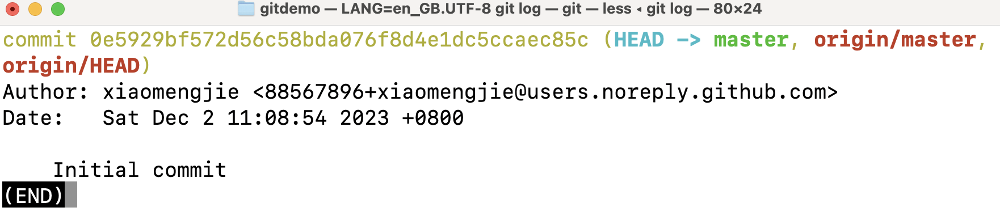

#### HEAD

永远指向**当前commit**的引用（工作目录对应的commit）。可以直接指向某个commit，也可以指向某个分支而间接指向commit

**HEAD通过指向branch而间接指向commit时，如果通过提交新的commit而移动HEAD，会连带着它指向的branch一起移动**

#### branch

指向某个commit的引用

#### master

默认的主分支名

#### origin/master

远端仓库master分支指向

#### origin/HEAD

远端仓库HEAD引用的指向
