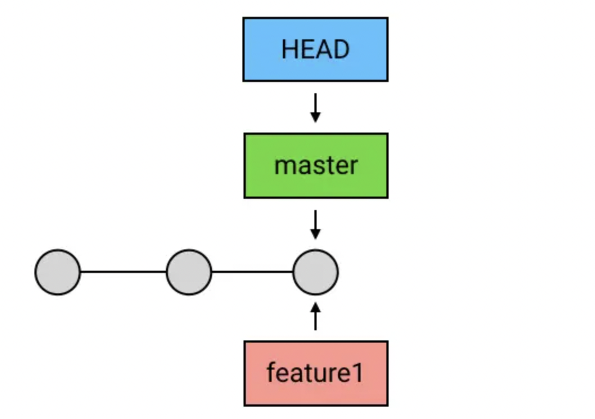
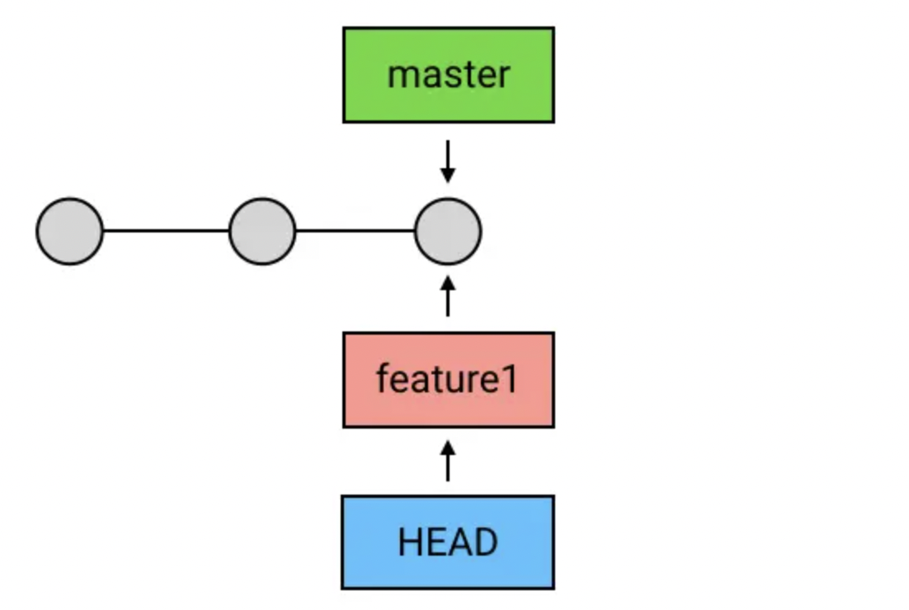

#### 创建branch

当想在某个commit中创建分支时，git branch 名称

> git branch feature1
>
> 

#### 切换branch

将当前的HEAD指向branch，git checkout 分支名

> git checkout feature1
>
> 

#### 创建+切换

git checkout -b 分支名

> git checkout -b feature1

#### 删除branch

git branch -d 分支名

> git branch -d feature1

如果branch被HEAD指向，则当前branch是无法删除的。需要先将HEAD引用checkout到其他commit
