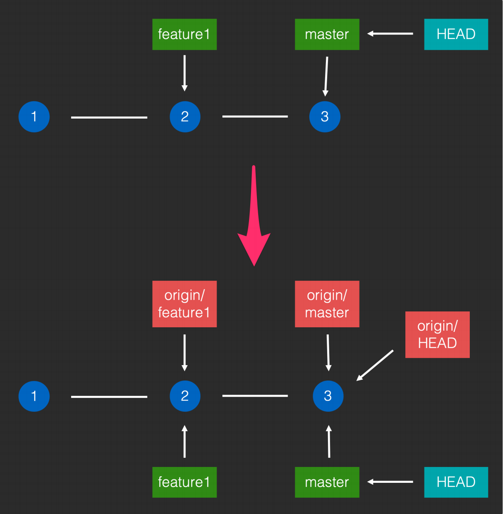

#### Clone仓库

当想将将远端仓库下载到本地时，使用 git clone xxx

> git clone https://github.com/square/okio.git

clone命令会做两件事

1. 将整个仓库的所有branch取下来，并把从初始commit到达这些branch路径上的所有commit都取下来
2. 从初始commit开始，默认会向master指向的commit，一个一个地应用。最终得到完整的内容，保存到工作目录中

