## 一次完整的HTTP请求Wireshark抓包分析

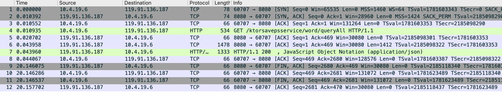

### TCP三次握手建立连接

#### 1、客户端发起SYN请求

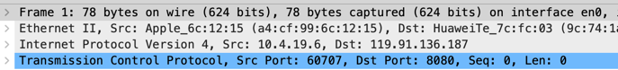

```java
Frame 1: 整体网络数据帧，78个字节
Ethernet II：数据链路层的数据
Internet Protocol：网络层数据
Transmission Control Protocol：传输层数据
```

**链路层数据：**

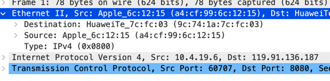

```java
客户端和服务器的mac地址
客户端 - Source: Apple_6c:12:15 (a4:cf:99:6c:12:15)
服务器 - Destination: HuaweiTe_7c:fc:03 (9c:74:1a:7c:fc:03)
```

**网络层数据：**

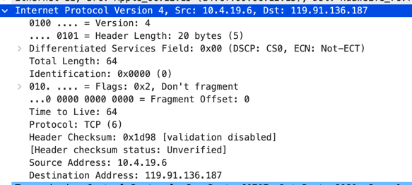

```java
Source Address: 10.4.19.6 - 客户端IP地址
Destination Address: 119.91.136.187 - 服务器IP地址
```

**传输层数据：**

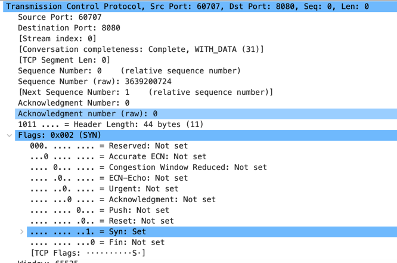

```java
Source Port: 60707 - 客户端端口号
Destination Port: 8080 - 服务器端口号
Sequence Number: 0    (relative sequence number) - 相对序列号
Sequence Number (raw): 3639200724 - 客户端发送的原始序列号seq
[Next Sequence Number: 1    (relative sequence number)]：下一个相对的序列号
Acknowledgment Number: 0 -> 相对确认号
Acknowledgment number (raw): 0 -> 原始确认号ack

.... .... ..1. = Syn: Set - SYN标识位为1，请求建立连接
```

#### 2、服务器回应ACK、SYN

**传输层数据：**

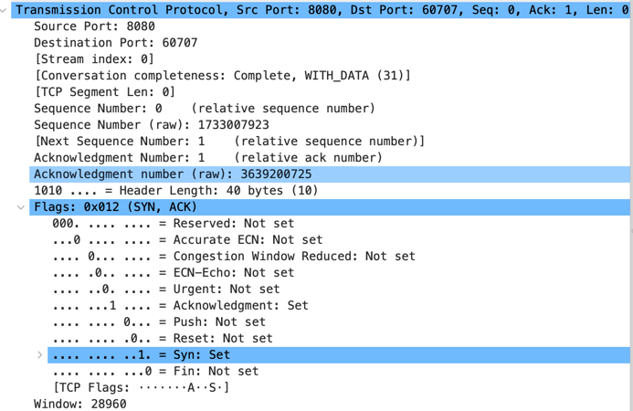

```java
Sequence Number (raw): 1733007923 - 服务器发送的序列号seq
Acknowledgment number (raw): 3639200725 - 服务器返回的ack = 客户端seq（3639200724） + 1
.... ...1 .... = Acknowledgment: Set - ACK标识位为1，确认收到请求
.... .... ..1. = Syn: Set - SYN标识位为1，请求建立连接
```

#### 3、客户端响应ACK

**传输层数据：**

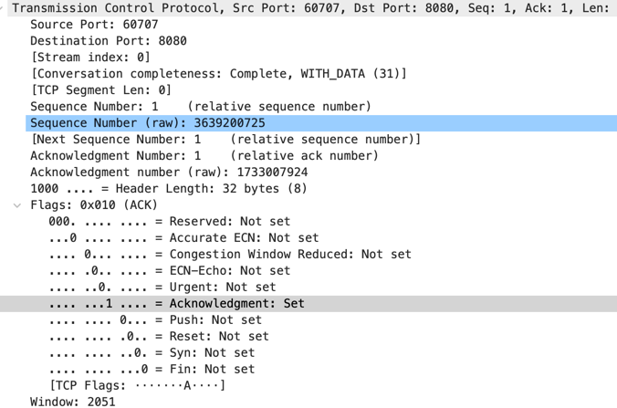

```java
Acknowledgment number (raw): 1733007924 - 客户端返回的ack = 服务器seq（1733007923） + 1
.... ...1 .... = Acknowledgment: Set - ACK标识位为1
```

### 连接连接完成，客户端发起HTTP请求

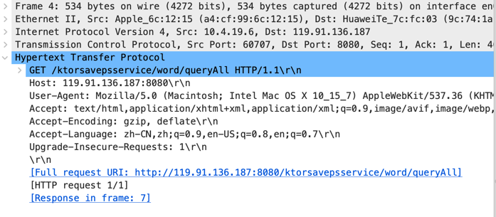

    请求包含请求行和首部
    GET /ktorsavepsservice/word/queryAll HTTP/1.1\r\n：Get请求，路径为ktorsavepsservice/word/queryAll，http版本1.1
    以回车换行符\r\n结束
    Host: 119.91.136.187:8080：字符串键值对，以回车换行符\r\n结束
    最后以两个回车换行符表示首部结束

### 服务器返回数据，切为两段，最后组合发送到客户端

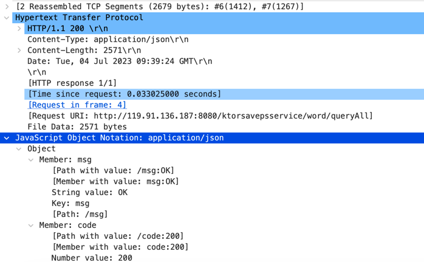

```

```

### 数据传输完成，断开连接，四次挥手

**服务器发起FIN**

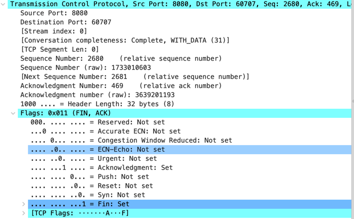

    Sequence Number (raw): 1733010603 - 序列号
    .... .... ...1 = Fin: Set - FIN标识为1

**客户端响应ACK**

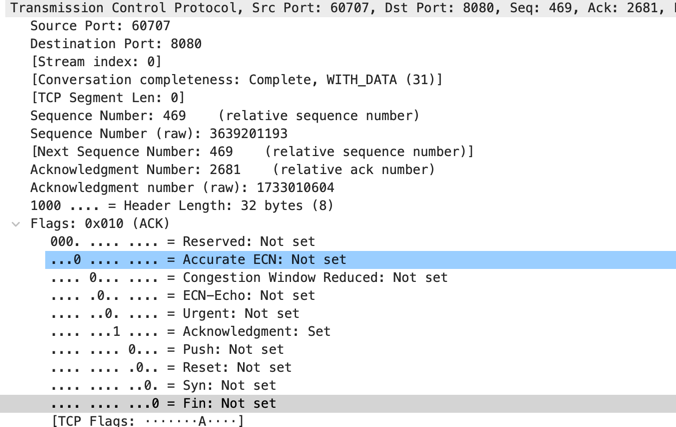

```
Acknowledgment number (raw): 1733010604 - ack号
.... ...1 .... = Acknowledgment: Set - ACK标识为1
```

**客户端发起FIN**

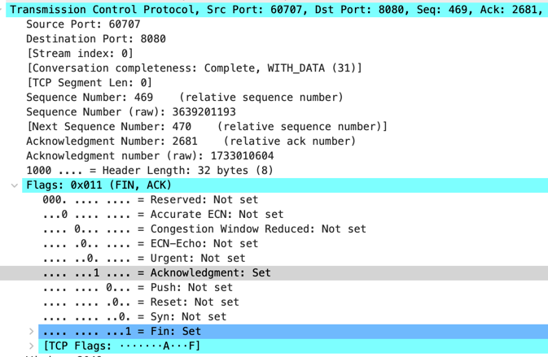

```
Sequence Number (raw): 3639201193 - 序列号
.... .... ...1 = Fin: Set - FIN标识为1
```

**服务器确定ACK**

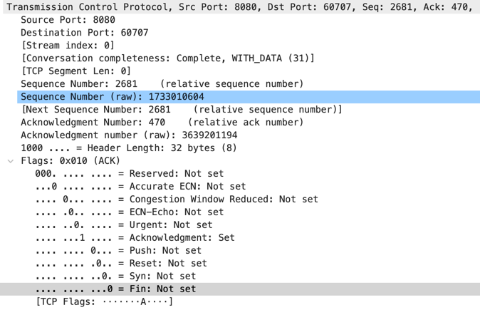

    Acknowledgment number (raw): 3639201194 - ack号
    .... ...1 .... = Acknowledgment: Set - ACK标识为1