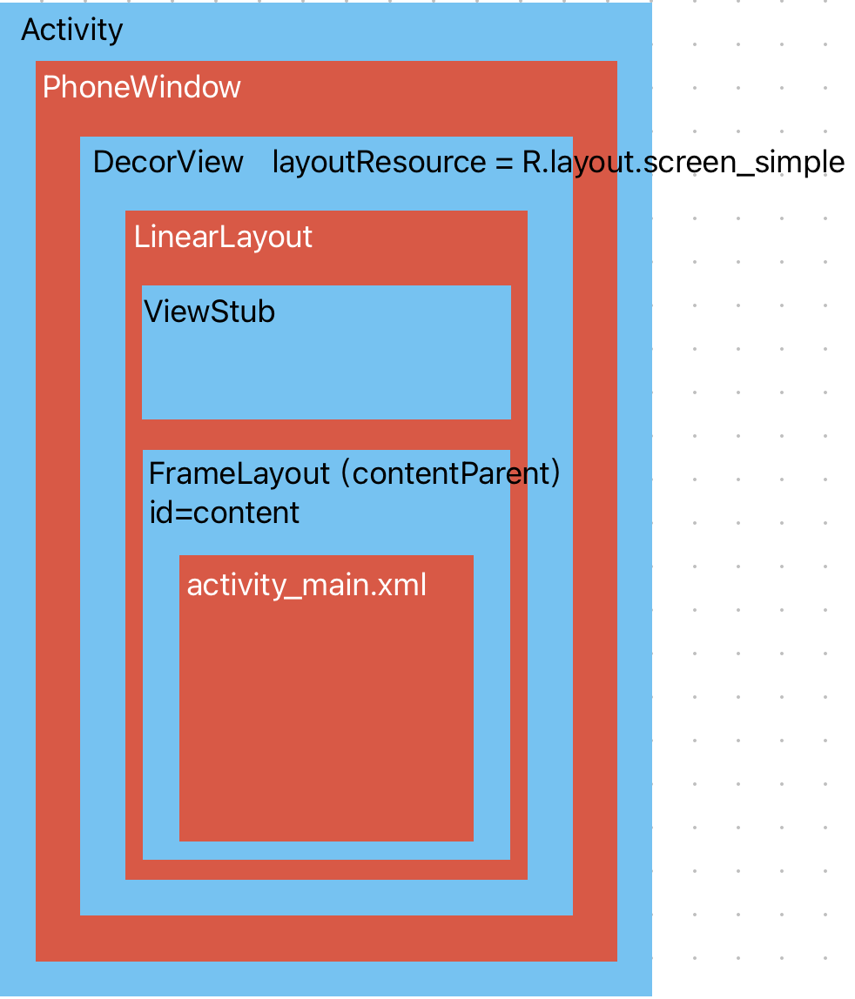
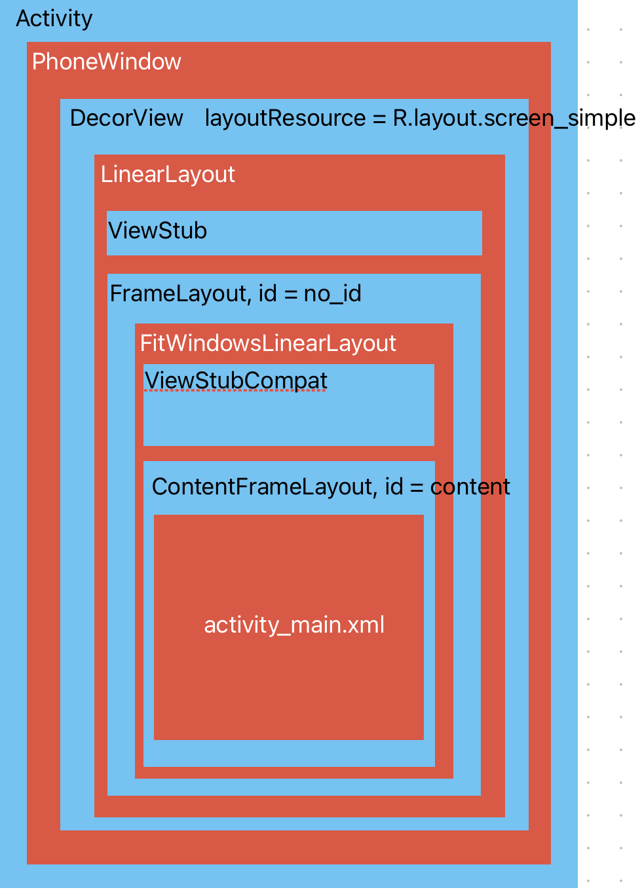

#### Activity的创建

##### handleLaunchActivity@ActivityThread

```java
--> handleLaunchActivity@ActivityThread
  
@Override
public Activity handleLaunchActivity(ActivityClientRecord r,
        PendingTransactionActions pendingActions, int deviceId, Intent customIntent) {
  	...
    final Activity a = performLaunchActivity(r, customIntent);
  	...
    return a;
}
```

##### performLaunchActivity@ActivityThread

```java
--> performLaunchActivity@ActivityThread

private Activity performLaunchActivity(ActivityClientRecord r, Intent customIntent) {
		...
		//创建activity的上下文
    ContextImpl appContext = createBaseContextForActivity(r);
    Activity activity = null;
    try {
        java.lang.ClassLoader cl = appContext.getClassLoader();
      	//在Instrumentation类中通过activity的全类名反射创建activity
      	//
        activity = mInstrumentation.newActivity(
                cl, component.getClassName(), r.intent);
        ...
    } catch (Exception e) {
        if (!mInstrumentation.onException(activity, e)) {
            throw new RuntimeException(
                "Unable to instantiate activity " + component
                + ": " + e.toString(), e);
        }
    }

    try {
      	//如果application已经创建，则直接返回。否则创建application。保证application创建成功
        Application app = r.packageInfo.makeApplicationInner(false, mInstrumentation);
        ...
        if (activity != null) {
          	...
            //调用attach方法
            activity.attach(appContext, this, getInstrumentation(), r.token,
                    r.ident, app, r.intent, r.activityInfo, title, r.parent,
                    r.embeddedID, r.lastNonConfigurationInstances, config,
                    r.referrer, r.voiceInteractor, window, r.activityConfigCallback,
                    r.assistToken, r.shareableActivityToken);
						...
            //调用activity的onCreate方法
            r.activity = activity;
            if (r.isPersistable()) {
                mInstrumentation.callActivityOnCreate(activity, r.state, r.persistentState);
            } else {
                mInstrumentation.callActivityOnCreate(activity, r.state);
            }
          	...
        }
      	//设置此时的状态为ON_CREATE
        r.setState(ON_CREATE);

    } catch (SuperNotCalledException e) {
        throw e;
    } catch (Exception e) {
        if (!mInstrumentation.onException(activity, e)) {
            throw new RuntimeException(
                "Unable to start activity " + component
                + ": " + e.toString(), e);
        }
    }
    return activity;
}
```

##### attach@Activity

```java
--->attach@Activity

final void attach(Context context, ActivityThread aThread,
        Instrumentation instr, IBinder token, int ident,
        Application application, Intent intent, ActivityInfo info,
        CharSequence title, Activity parent, String id,
        NonConfigurationInstances lastNonConfigurationInstances,
        Configuration config, String referrer, IVoiceInteractor voiceInteractor,
        Window window, ActivityConfigCallback activityConfigCallback, IBinder assistToken,
        IBinder shareableActivityToken) {
  	//上下文绑定
    attachBaseContext(context);
		...
    //创建PhoneWindow，其中会初始化mLayoutInflater(PhoneLayoutInflater)
    mWindow = new PhoneWindow(this, window, activityConfigCallback);
    ...
  	//设置LayoutInflater的PrivateFactory
    mWindow.getLayoutInflater().setPrivateFactory(this);
		...
		//设置windowManager（WindowManagerImpl类型）
    mWindow.setWindowManager(
            (WindowManager)context.getSystemService(Context.WINDOW_SERVICE),
            mToken, mComponent.flattenToString(),
            (info.flags & ActivityInfo.FLAG_HARDWARE_ACCELERATED) != 0);
}
```

#### 在onCreate中setContentView

1. Activity.setContentView
2. AppCompatDelegateImpl.setContentView

#### Activity.setContentView

```java
--->setContentView@Activity:

public void setContentView(@LayoutRes int layoutResID) {
  	//调用PhoneWindow的setContentView
    getWindow().setContentView(layoutResID);
    initWindowDecorActionBar();
}
```

##### setContentView@PhoneWindow

```java
----> setContentView@PhoneWindow:

public void setContentView(int layoutResID) {
    //mContentParent为null时调用installDecor初始化
    if (mContentParent == null) {
        installDecor();
    } else if (!hasFeature(FEATURE_CONTENT_TRANSITIONS)) {
        mContentParent.removeAllViews();
    }
		
    if (hasFeature(FEATURE_CONTENT_TRANSITIONS)) {
      	//过渡动画相关？？？
        final Scene newScene = Scene.getSceneForLayout(mContentParent, layoutResID,
                getContext());
        transitionTo(newScene);
    } else {
      	//通过LayoutInflate将xml布局解析添加到mContentParent中
        mLayoutInflater.inflate(layoutResID, mContentParent);
    }
    ...
    
    //mContentParentExplicitlySet在requestFeature方法中会判断，如果为true，会抛出AndroidRuntimeException异常
    //所以在activity中调用requestWindowFeature()时，必须在setContentView前面
    mContentParentExplicitlySet = true;
}
```

##### installDecor@PhoneWindow

```java
----> installDecor@PhoneWindow:

private void installDecor() {
    mForceDecorInstall = false;
    if (mDecor == null) {
      	//创建DecorView
      	//就是直接new。return new DecorView(context, featureId, this, getAttributes());
      	//phoneWindow和DecorView关联
        mDecor = generateDecor(-1);
        ...
    } else {
      	//设置window
        mDecor.setWindow(this);
    }
  	
    if (mContentParent == null) {
      	//调用generateLayout初始化mContentParent
        mContentParent = generateLayout(mDecor);
				...
          
      	//DecorView的背景
        if (mDecor.getBackground() == null && mBackgroundFallbackDrawable != null) {
            mDecor.setBackgroundFallback(mBackgroundFallbackDrawable);
        }

        //过渡动画相关
        if (hasFeature(FEATURE_ACTIVITY_TRANSITIONS)) {
            ...
        }
    }
}
```

**generateLayout@PhoneWindow:**

```java
----> generateLayout@PhoneWindow:

protected ViewGroup generateLayout(DecorView decor) {
    
		//从Theme中获取到统一的配置集合，设置样式
  	//在values/theme.xml中配置，在manifest.xml中的application标签下应用
    TypedArray a = getWindowStyle();
		...
		
		//根据不同的配置，选择不同的布局文件（默认：R.layout.screen_simple）
    int layoutResource;
    int features = getLocalFeatures();
    ...
    } else {
        layoutResource = R.layout.screen_simple;
    }

  	//假设layoutResource = R.layout.screen_simple
    mDecor.startChanging();
  	//解析layoutResource布局文件，并且添加到mDecor中（布局文件和decorview关联起来了）
    mDecor.onResourcesLoaded(mLayoutInflater, layoutResource);
		
  	//在DecorView中查找id = ID_ANDROID_CONTENT的View，并赋值给contentParent
    ViewGroup contentParent = (ViewGroup)findViewById(ID_ANDROID_CONTENT);
    if (contentParent == null) {
      	//没有抛异常
        throw new RuntimeException("Window couldn't find content container view");
    }
		...
    return contentParent;
}
```

**onResourcesLoaded@DecorView**

```java
----> onResourcesLoaded@DecorView:

void onResourcesLoaded(LayoutInflater inflater, int layoutResource) {
    ...
		//mDecorCaptionView字幕相关？？？没用到过
    mDecorCaptionView = createDecorCaptionView(inflater);
  	//解析xml文件
    final View root = inflater.inflate(layoutResource, null);
    if (mDecorCaptionView != null) {
        ...
    } else {
      	//添加到DecorView，宽高为MATCH_PARENT
        addView(root, 0, new ViewGroup.LayoutParams(MATCH_PARENT, MATCH_PARENT));
    }
   ...
}
```

最终得到的图层为：



#### AppCompatDelegateImpl.setContentView

```java
@Override
public void setContentView(int resId) {
  	//创建SubDecor
  	//将activity.setContentView流程下的content（FrameLayout）的ID设置NO_ID
  	//将SubDecor中的ContentFrameLayout的ID设置为content
  	//将SubDecor添加到mParentContent（就是原来的FrameLayout）中
    ensureSubDecor();
  	//找到contentParent
    ViewGroup contentParent = mSubDecor.findViewById(android.R.id.content);
    contentParent.removeAllViews();
  	//解析布局添加到contentParent
    LayoutInflater.from(mContext).inflate(resId, contentParent);
    mAppCompatWindowCallback.bypassOnContentChanged(mWindow.getCallback());
}
```

##### ensureSubDecor@AppCompatDelegateImpl

```java
private void ensureSubDecor() {
    if (!mSubDecorInstalled) {
        mSubDecor = createSubDecor();
				...
    }
}
```

##### createSubDecor@AppCompatDelegateImpl

```java
private ViewGroup createSubDecor() {
  	//根据主题设置进行不同的配置
    TypedArray a = mContext.obtainStyledAttributes(R.styleable.AppCompatTheme);
		...
		
    //保证PhoneWindow已经创建
    ensureWindow();
  	//获取decorview，如果decorview为null，会调用phoneWindow.installDecor
  	//installDecor：进行Activity.setContentView时的流程
  	//创建decorview，选择布局解析添加到decorview，并将我们设置的布局添加到id = content的控件中
    mWindow.getDecorView();
		
    final LayoutInflater inflater = LayoutInflater.from(mContext);
    ViewGroup subDecor = null;
  
		//根据主题的配置信息，选择布局解析，mWindowNoTitle == true
    if (!mWindowNoTitle) {
        ...
    } else {
        if (mOverlayActionMode) {
            subDecor = (ViewGroup) inflater.inflate(
                    R.layout.abc_screen_simple_overlay_action_mode, null);
        } else {
            //会到这里来啦，subDecor == FitWindowsLinearLayout
            subDecor = (ViewGroup) inflater.inflate(R.layout.abc_screen_simple, null);
        }
    }
		
  	//保证subDecor不为null
    if (subDecor == null) {
        throw new IllegalArgumentException(
                "AppCompat does not support the current theme features: { "
                        + "windowActionBar: " + mHasActionBar
                        + ", windowActionBarOverlay: "+ mOverlayActionBar
                        + ", android:windowIsFloating: " + mIsFloating
                        + ", windowActionModeOverlay: " + mOverlayActionMode
                        + ", windowNoTitle: " + mWindowNoTitle
                        + " }");
    }
  
    ...
		//从布局文件可知，contentView == ContentFrameLayout
    final ContentFrameLayout contentView = (ContentFrameLayout) subDecor.findViewById(
            R.id.action_bar_activity_content);
		
  	//找到decorview中的content
    final ViewGroup windowContentView = (ViewGroup) mWindow.findViewById(android.R.id.content);
  
    if (windowContentView != null) {
        //如果content中已添加子view，移除添加到contentView中
        while (windowContentView.getChildCount() > 0) {
            final View child = windowContentView.getChildAt(0);
            windowContentView.removeViewAt(0);
            contentView.addView(child);
        }
				
      	//将原来decorview中的contentview的id设置为NO_ID
        windowContentView.setId(View.NO_ID);
      	//将新的contentView的id设置为android.R.id.content
        contentView.setId(android.R.id.content);
				...
    }

    //将subDecor == FitWindowsLinearLayout，添加到mContentParent（原来id=content的frameLayout）中
    mWindow.setContentView(subDecor);
		
    return subDecor;
}
```

##### setContentView@PhoneWindow:

```java
@Override
public void setContentView(View view, ViewGroup.LayoutParams params) {
    if (mContentParent == null) {
        installDecor();
    } else if (!hasFeature(FEATURE_CONTENT_TRANSITIONS)) {
        mContentParent.removeAllViews();
    }

    if (hasFeature(FEATURE_CONTENT_TRANSITIONS)) {
        view.setLayoutParams(params);
        final Scene newScene = new Scene(mContentParent, view);
        transitionTo(newScene);
    } else {
      	//直接到这里，view = subDecor，添加到mContentParent中
        mContentParent.addView(view, params);
    }
    ...
}
```

最终得到的图层为：



#### XML布局：

##### screen_simple.xml

```xml
<?xml version="1.0" encoding="utf-8"?>
<!--
/* //device/apps/common/assets/res/layout/screen_simple.xml
**
** Copyright 2006, The Android Open Source Project
**
** Licensed under the Apache License, Version 2.0 (the "License"); 
** you may not use this file except in compliance with the License. 
** You may obtain a copy of the License at 
**
**     http://www.apache.org/licenses/LICENSE-2.0 
**
** Unless required by applicable law or agreed to in writing, software 
** distributed under the License is distributed on an "AS IS" BASIS, 
** WITHOUT WARRANTIES OR CONDITIONS OF ANY KIND, either express or implied. 
** See the License for the specific language governing permissions and 
** limitations under the License.
*/
This is an optimized layout for a screen, with the minimum set of features
enabled.
-->
<LinearLayout xmlns:android="http://schemas.android.com/apk/res/android"
    android:layout_width="match_parent"
    android:layout_height="match_parent"
    android:fitsSystemWindows="true"
    android:orientation="vertical">
    <ViewStub android:id="@+id/action_mode_bar_stub"
              android:inflatedId="@+id/action_mode_bar"
              android:layout="@layout/action_mode_bar"
              android:layout_width="match_parent"
              android:layout_height="wrap_content"
              android:theme="?attr/actionBarTheme" />
    <FrameLayout
         android:id="@android:id/content"
         android:layout_width="match_parent"
         android:layout_height="match_parent"
         android:foregroundInsidePadding="false"
         android:foregroundGravity="fill_horizontal|top"
         android:foreground="?android:attr/windowContentOverlay" />
</LinearLayout>

```

##### abc_screen_simple.xml

```xml
<?xml version="1.0" encoding="utf-8"?>
<!-- Copyright (C) 2013 The Android Open Source Project
     Licensed under the Apache License, Version 2.0 (the "License");
     you may not use this file except in compliance with the License.
     You may obtain a copy of the License at
          http://www.apache.org/licenses/LICENSE-2.0
     Unless required by applicable law or agreed to in writing, software
     distributed under the License is distributed on an "AS IS" BASIS,
     WITHOUT WARRANTIES OR CONDITIONS OF ANY KIND, either express or implied.
     See the License for the specific language governing permissions and
     limitations under the License.
-->
<android.support.v7.widget.FitWindowsLinearLayout
    xmlns:android="http://schemas.android.com/apk/res/android"
    android:id="@+id/action_bar_root"
    android:layout_width="match_parent"
    android:layout_height="match_parent"
    android:orientation="vertical"
    android:fitsSystemWindows="true">
    <android.support.v7.widget.ViewStubCompat
        android:id="@+id/action_mode_bar_stub"
        android:inflatedId="@+id/action_mode_bar"
        android:layout="@layout/abc_action_mode_bar"
        android:layout_width="match_parent"
        android:layout_height="wrap_content" />
    <include layout="@layout/abc_screen_content_include" />
</android.support.v7.widget.FitWindowsLinearLayout>
```

##### abc_screen_content_include.xml

```xml
<?xml version="1.0" encoding="utf-8"?>
<!-- Copyright (C) 2014 The Android Open Source Project
     Licensed under the Apache License, Version 2.0 (the "License");
     you may not use this file except in compliance with the License.
     You may obtain a copy of the License at
          http://www.apache.org/licenses/LICENSE-2.0
     Unless required by applicable law or agreed to in writing, software
     distributed under the License is distributed on an "AS IS" BASIS,
     WITHOUT WARRANTIES OR CONDITIONS OF ANY KIND, either express or implied.
     See the License for the specific language governing permissions and
     limitations under the License.
-->
<merge xmlns:android="http://schemas.android.com/apk/res/android">
    <android.support.v7.widget.ContentFrameLayout
            android:id="@id/action_bar_activity_content"
            android:layout_width="match_parent"
            android:layout_height="match_parent"
            android:foregroundGravity="fill_horizontal|top"
            android:foreground="?android:attr/windowContentOverlay" />
</merge>
```

