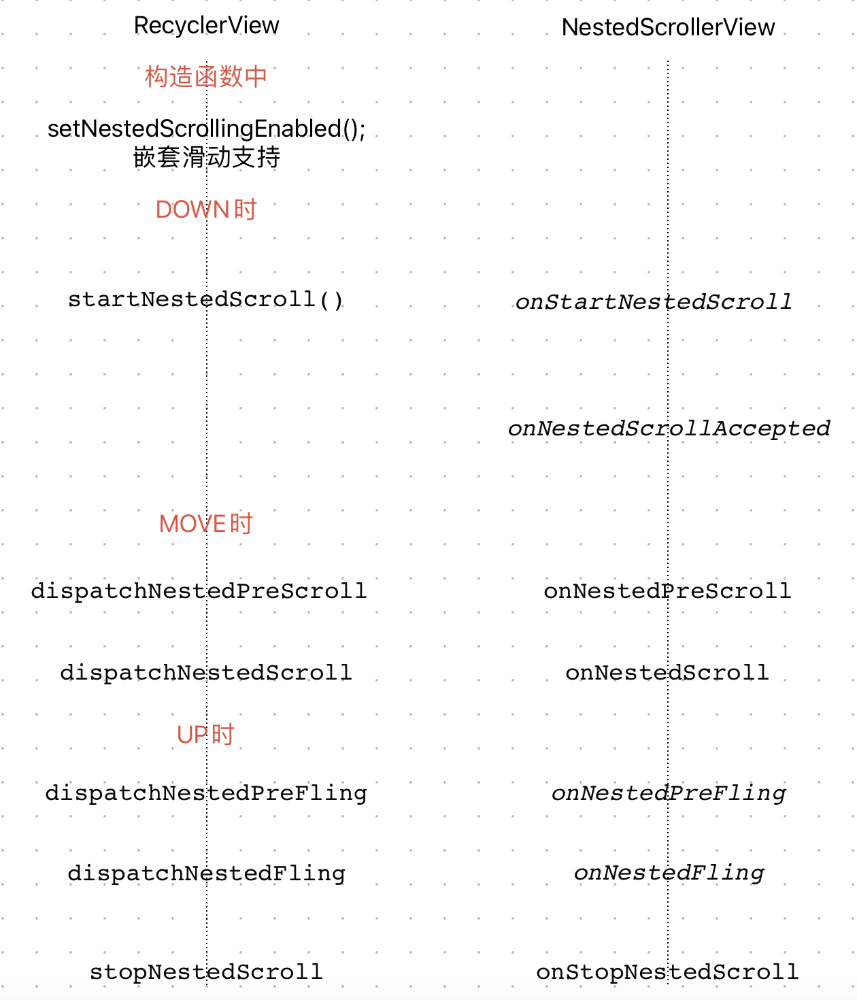

#### RecyclerView配合NestedScrollerView实现嵌套滑动

​	

#### DOWN

##### RecyclerView.startNestedScroll@View

```java
----> startNestedScroll@View:

public boolean startNestedScroll(int axes) {
  //已经开始嵌套滑动，直接返回
		if (hasNestedScrollingParent()) {
        // Already in progress
        return true;
    }
    if (isNestedScrollingEnabled()) {
        ViewParent p = getParent();
        View child = this;
        while (p != null) {
          //向上遍历找到支持嵌套滑动的父View
            try {
              //调用父View的onStartNestedScroll
                if (p.onStartNestedScroll(child, this, axes)) {
                  //mNestedScrollingParent赋值，记录嵌套滑动的父View
                    mNestedScrollingParent = p;
                  //onNestedScrollAccepted调用
                    p.onNestedScrollAccepted(child, this, axes);
                    return true;
                }
            } catch (AbstractMethodError e) {
                Log.e(VIEW_LOG_TAG, "ViewParent " + p + " does not implement interface " +
                        "method onStartNestedScroll", e);
                // Allow the search upward to continue
            }
            if (p instanceof View) {
                child = (View) p;
            }
            p = p.getParent();
        }
    }
    return false;
}
```

##### NestedScrollView.onStartNestedScroll

```java
----> onStartNestedScroll:NestedScrollView:

public boolean onStartNestedScroll(@NonNull View child, @NonNull View target, int axes,
        int type) {
  //方向是否为垂直方向
    return (axes & ViewCompat.SCROLL_AXIS_VERTICAL) != 0;
}
```

##### NestedScrollView.onNestedScrollAccepted

```java
----> onNestedScrollAccepted:NestedScrollView:

@Override
public void onNestedScrollAccepted(@NonNull View child, @NonNull View target, int axes,
        int type) {
  //记下方向
    mParentHelper.onNestedScrollAccepted(child, target, axes, type);
  //NestedScrollView也实现了NestedScrollingChild，所以也调用startNestedScroll
    startNestedScroll(ViewCompat.SCROLL_AXIS_VERTICAL, type);
}
```

#### MOVE

##### RecyclerView.dispatchNestedPreScroll@View

```java
----> dispatchNestedPreScroll@View:

public boolean dispatchNestedPreScroll(int dx, int dy,
        @Nullable @Size(2) int[] consumed, @Nullable @Size(2) int[] offsetInWindow) {
  //支持嵌套滑动，和已经找到父View
    if (isNestedScrollingEnabled() && mNestedScrollingParent != null) {
        if (dx != 0 || dy != 0) {
            int startX = 0;
            int startY = 0;
            if (offsetInWindow != null) {
                getLocationInWindow(offsetInWindow);
                startX = offsetInWindow[0];
                startY = offsetInWindow[1];
            }

            if (consumed == null) {
                if (mTempNestedScrollConsumed == null) {
                    mTempNestedScrollConsumed = new int[2];
                }
                consumed = mTempNestedScrollConsumed;
            }
          //用来记录水平消耗距离和垂直消耗距离
            consumed[0] = 0;
            consumed[1] = 0;
          //onNestedPreScroll调用，父View需不需要先滑动
            mNestedScrollingParent.onNestedPreScroll(this, dx, dy, consumed);

            if (offsetInWindow != null) {
                getLocationInWindow(offsetInWindow);
                offsetInWindow[0] -= startX;
                offsetInWindow[1] -= startY;
            }
          //返回值判断父View是否滑动了
            return consumed[0] != 0 || consumed[1] != 0;
        } else if (offsetInWindow != null) {
            offsetInWindow[0] = 0;
            offsetInWindow[1] = 0;
        }
    }
    return false;
}
```

##### NestedScrollView.onNestedPreScroll

```java
----> onNestedPreScroll@NestedScrollView

public void onNestedPreScroll(@NonNull View target, int dx, int dy, @NonNull int[] consumed,
        int type) {
  //NestedScrollView不会滑动，而是分发给自己的支持嵌套滑动的父View
    dispatchNestedPreScroll(dx, dy, consumed, null, type);
}
```

##### RecyclerView.dispatchNestedScroll@View

```java
----> dispatchNestedScroll@View:

public boolean dispatchNestedScroll(int dxConsumed, int dyConsumed,
        int dxUnconsumed, int dyUnconsumed, @Nullable @Size(2) int[] offsetInWindow) {
  //同样的判断
    if (isNestedScrollingEnabled() && mNestedScrollingParent != null) {
        if (dxConsumed != 0 || dyConsumed != 0 || dxUnconsumed != 0 || dyUnconsumed != 0) {
            int startX = 0;
            int startY = 0;
            if (offsetInWindow != null) {
                getLocationInWindow(offsetInWindow);
                startX = offsetInWindow[0];
                startY = offsetInWindow[1];
            }
          //onNestedScroll，再次问下父View要不要滑动
            mNestedScrollingParent.onNestedScroll(this, dxConsumed, dyConsumed,
                    dxUnconsumed, dyUnconsumed);

            if (offsetInWindow != null) {
                getLocationInWindow(offsetInWindow);
                offsetInWindow[0] -= startX;
                offsetInWindow[1] -= startY;
            }
            return true;
        } else if (offsetInWindow != null) {
            // No motion, no dispatch. Keep offsetInWindow up to date.
            offsetInWindow[0] = 0;
            offsetInWindow[1] = 0;
        }
    }
    return false;
}
```

##### NestedScrollView.onNestedScroll

```java
----> onNestedScroll@NestedScrollView

public void onNestedScroll(@NonNull View target, int dxConsumed, int dyConsumed,
        int dxUnconsumed, int dyUnconsumed, int type, @NonNull int[] consumed) {
    onNestedScrollInternal(dyUnconsumed, type, consumed);
}

private void onNestedScrollInternal(int dyUnconsumed, int type, @Nullable int[] consumed) {
    final int oldScrollY = getScrollY();
  //上下滑动
    scrollBy(0, dyUnconsumed);
    final int myConsumed = getScrollY() - oldScrollY;

  //增加已经滑动的距离
    if (consumed != null) {
        consumed[1] += myConsumed;
    }
    final int myUnconsumed = dyUnconsumed - myConsumed;

  //问问父View需不需要滑动
    mChildHelper.dispatchNestedScroll(0, myConsumed, 0, myUnconsumed, null, type, consumed);
}
```

#### UP

##### RecyclerView.dispatchNestedPreFling@View

```java
----> dispatchNestedPreFling@View
  
public boolean dispatchNestedPreFling(float velocityX, float velocityY) {
    if (isNestedScrollingEnabled() && mNestedScrollingParent != null) {
      //onNestedPreFling询问父View需不需要先惯性滑动
        return mNestedScrollingParent.onNestedPreFling(this, velocityX, velocityY);
    }
    return false;
}
```

##### NestedScrollView.onNestedPreFling

```java
----> onNestedPreFling@NestedScrollView

public boolean onNestedPreFling(@NonNull View target, float velocityX, float velocityY) {
    return dispatchNestedPreFling(velocityX, velocityY);
}

@Override
public boolean dispatchNestedPreFling(float velocityX, float velocityY) {
  //NestedScrollView也只是会询问下父View需不需要先惯性滑动
    return mChildHelper.dispatchNestedPreFling(velocityX, velocityY);
}
```

##### RecyclerView.dispatchNestedFling@View

```java
----> dispatchNestedFling@View

public boolean dispatchNestedFling(float velocityX, float velocityY, boolean consumed) {
    if (isNestedScrollingEnabled() && mNestedScrollingParent != null) {
        return mNestedScrollingParent.onNestedFling(this, velocityX, velocityY, consumed);
    }
    return false;
}
```

##### NestedScrollView.onNestedFling

```java
----> onNestedFling@NestedScrollView

@Override
public boolean onNestedFling(
        @NonNull View target, float velocityX, float velocityY, boolean consumed) {
  //在onNestedPreFling时没有滑动
    if (!consumed) {
      //先问父View需不需要滑动，此时传入的consumed会为true
        dispatchNestedFling(0, velocityY, true);
      //自己滑动
        fling((int) velocityY);
        return true;
    }
    return false;
}
```

##### NestedScrollView.fling

```java
----> fling@NestedScrollView

public void fling(int velocityY) {
    if (getChildCount() > 0) {
      //交给OverScroller计算
        mScroller.fling(getScrollX(), getScrollY(), // start
                0, velocityY, // velocities
                0, 0, // x
                Integer.MIN_VALUE, Integer.MAX_VALUE, // y
                0, 0); // overscroll
      //下一帧更新
        runAnimatedScroll(true);
    }
}
```

##### NestedScrollView.computeScroll

```java
----> computeScroll@NestedScrollView

public void computeScroll() {

    if (mScroller.isFinished()) {
        return;
    }
		
  //计算偏移
    mScroller.computeScrollOffset();
    final int y = mScroller.getCurrY();
  //计算下要滑动多远
    int unconsumed = consumeFlingInVerticalStretch(y - mLastScrollerY);
    mLastScrollerY = y;

  //问下父View需不需要先滑
    mScrollConsumed[1] = 0;
    dispatchNestedPreScroll(0, unconsumed, mScrollConsumed, null,
            ViewCompat.TYPE_NON_TOUCH);
  //确定能滑动的距离
    unconsumed -= mScrollConsumed[1];

    final int range = getScrollRange();

    if (unconsumed != 0) {
        // Internal Scroll
        final int oldScrollY = getScrollY();
      //滑动
        overScrollByCompat(0, unconsumed, getScrollX(), oldScrollY, 0, range, 0, 0, false);
        final int scrolledByMe = getScrollY() - oldScrollY;
      //最终还剩下能滑动的距离
        unconsumed -= scrolledByMe;

        // Nested Scrolling Post Pass
        mScrollConsumed[1] = 0;
      //父View滑不滑
        dispatchNestedScroll(0, scrolledByMe, 0, unconsumed, mScrollOffset,
                ViewCompat.TYPE_NON_TOUCH, mScrollConsumed);
        unconsumed -= mScrollConsumed[1];
    }

    if (unconsumed != 0) {
      //过度滑动相关？？？？
        final int mode = getOverScrollMode();
        final boolean canOverscroll = mode == OVER_SCROLL_ALWAYS
                || (mode == OVER_SCROLL_IF_CONTENT_SCROLLS && range > 0);
        if (canOverscroll) {
            if (unconsumed < 0) {
                if (mEdgeGlowTop.isFinished()) {
                    mEdgeGlowTop.onAbsorb((int) mScroller.getCurrVelocity());
                }
            } else {
                if (mEdgeGlowBottom.isFinished()) {
                    mEdgeGlowBottom.onAbsorb((int) mScroller.getCurrVelocity());
                }
            }
        }
        abortAnimatedScroll();
    }

  //未完结，下一帧继续
    if (!mScroller.isFinished()) {
        ViewCompat.postInvalidateOnAnimation(this);
    } else {
        stopNestedScroll(ViewCompat.TYPE_NON_TOUCH);
    }
}
```

